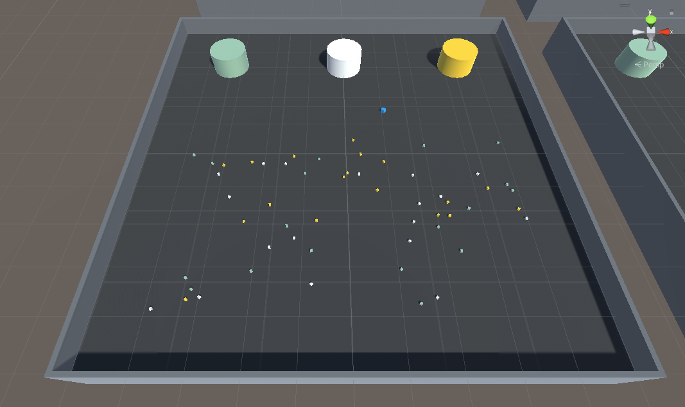
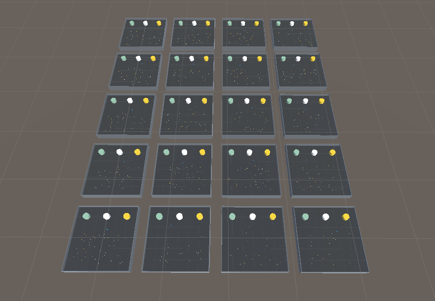

# mla-garbage-collector

## Introducción
La propuesta consiste en hacer uso de herramientas gráficas para generar una simulación de un escenario en el cual un agente con la ayuda de la aplicación de machine learning pueda interactuar de manera autónoma con distintos elementos del entorno y con el tiempo entrenarse para mejorar esa toma de decisiones independiente de una intervención humana.

El ambiente específico que se desea emular es el de una entidad que recolecta residuos. Esta entidad sería capaz de moverse para encontrar elementos. Estos elementos serían los residuos los cuales podría identificar como tales y a su vez los clasificaría según sus características. Las tareas que deberá completar esta entidad son recorrer el entorno desplegado, recolectar todos los residuos presentes en el entorno desplegado y clasificar los residuos recolectados. El objetivo final es que esta entidad logre la recolección y clasificación de todos los residuos desplegados en el entorno.

## Vista previa *(v1.0.17)*
- Un area de entrenamiento unica.
    

- Paralelismo utilizado en la formación (20 areas simultaneas)
    

## Autores
- Salaberria Sebastian
- Rodriguez Joaquín

## Keywords
Machine learning - Reinforcement learning - Unity - MLAgents - Garbage collector - Proyecto final - Ingenieria de en sistemas - Universidad Nacional del Sur